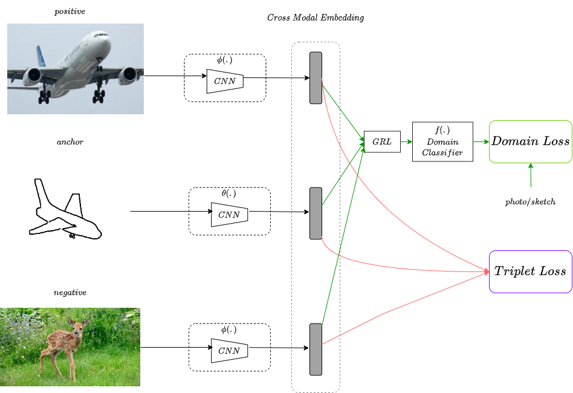
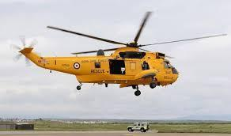
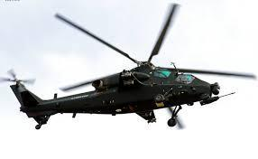
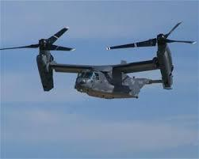
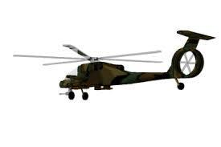
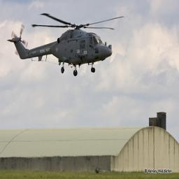
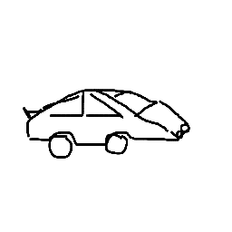
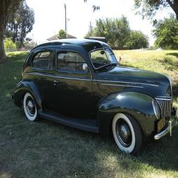

 

# Zero Shot Sketch-Based Image Retrieval

The problem of retrieving images from a large-database using ambiguous sketches has been addressed. This problem has been addressed in the **zero-shot scenario**, where the test sketches/images are from **unseen classes** and the deep feature extractor's output embedding distances of the sketch and the image have been used to retrieve the top k closest images from the image database of the unseen classes.

The standard **triplet loss** has been used, along with a **domain loss**, which is trained to differentiate between sketches and images.

The embedding is passed in to **gradient reversal layer** <sup>1</sup>, and then into a domain-classifier network, and then into the domain loss. The **gradient reversal layer** acts as an **identity layer in the forward pass**, and **multiplies the gradient by -1 in the backward pass** which results in the main network learning a **domain-agnostic representation** i.e. to fool the domain-classifier network.

# Architecture Overview



<sub>† Diagram created by Arjun Ashok using [app.diagrams.net](http://app.diagrams.net)</sub> 

# Results on unseen(zero-shot) classes

The below table presents a few qualitative results of our model on unseen test classes. The table presents the top 5 results from left to right.
  
| Query Sketch 1  |
|:---------------:|
||

| Retrieved Image 1 | Retrieved Image 2 | Retrieved Image 3 | Retrieved Image 4 | Retrieved Image 5 |
|:-----------------:|:-----------------:|:-----------------:|:-----------------:|:-----------------:|
||||||

| Query Sketch 2  |
|:---------------:|
||

| Retrieved Image 1 | Retrieved Image 2 | Retrieved Image 3 | Retrieved Image 4 | Retrieved Image 5 |
|:-----------------:|:-----------------:|:-----------------:|:-----------------:|:-----------------:|
||||||

# Instructions
<details>
<summary>
  <b>Installation</b>
</summary>

Please execute the following command to install the required libraries:

```
pip install -r requirements.txt
```

</details>
<details>
<summary>
<b>Data</b>
</summary>

Please download and extract this file:

[The Sketchy dataset](http://transattr.cs.brown.edu/files/aligned_images.tar) - 1.8 GB

</details>
<details>

<summary>
<b>Training</b>
</summary>

To be added

</details>

<details>

<summary>
<b>Inference</b>
</summary>

The file ```evaluate.py``` can be invoked with the following args:

```
usage: evaluate.py [-h] [--model MODEL] --data DATA [--num_images NUM_IMAGES]
                   [--num_sketches NUM_SKETCHES] [--batch_size BATCH_SIZE]
                   [--output_dir OUTPUT_DIR]

Evaluation of SBIR

arguments:
  -h, --help            show this help message and exit
  --model MODEL         Model checkpoint path
  --data DATA           Data directory path. Directory should contain two
                        folders - sketches and photos, along with 2 .txt files
                        for the labels
  --num_images NUM_IMAGES
                        Number of random images to output for every
                        sketch
  --num_sketches NUM_SKETCHES
                        Number of random sketches to output
  --batch_size BATCH_SIZE
                        Batch size to process the test sketches/photos
  --output_dir OUTPUT_DIR
                        Directory to save output sketch and images
```

</details>

# References

1. Ganin, Yaroslav et al. "Domain-Adversarial Training Of Neural Networks". Journal of Machine Learning Research, 2016, pp. 1-35, url:http://jmlr.org/papers/v17/15-239.html
